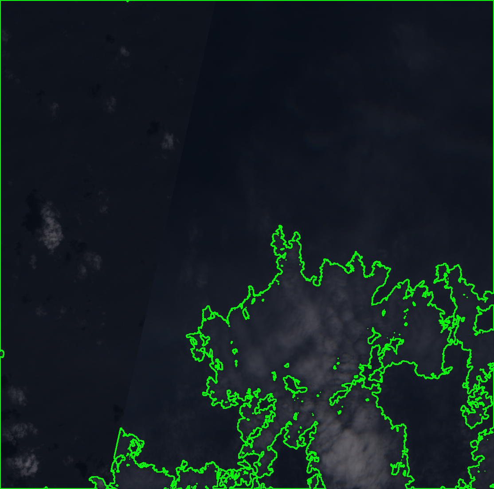
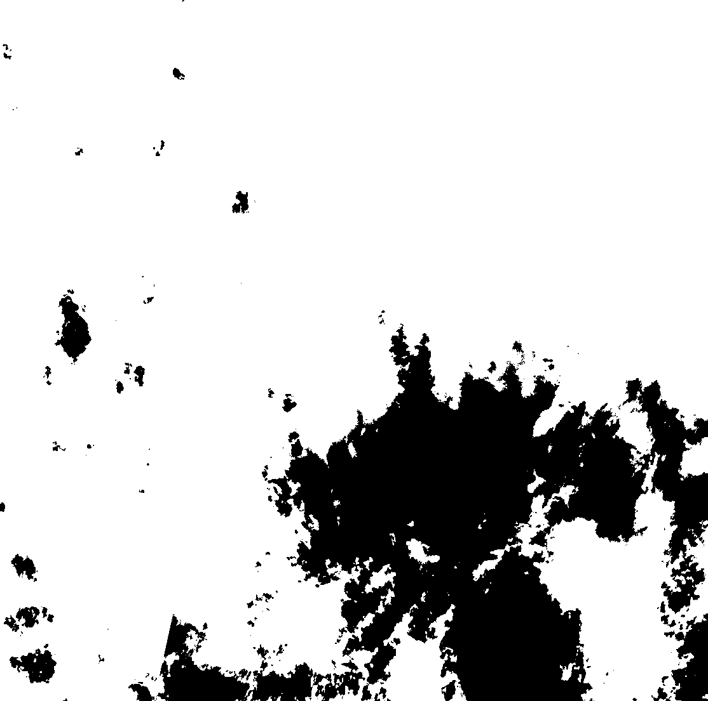

# Oil Spill Detection Using Sentinel-2 & CNNs

This project presents a scalable, high-performance system for **automated oil spill detection** using **Sentinel-2 satellite imagery**, **Convolutional Neural Networks (CNNs)**, and **Apache Spark** for distributed processing. It is designed to detect and monitor oil spills in maritime zones such as the Gulf of Mexico, Mumbai Coast, and Port of Los Angeles.

---

## Key Features

- Access high-resolution Sentinel-2 imagery using Sentinel Hub API  
- CNN-based image classification for accurate oil spill detection  
- Image preprocessing, thresholding, and contour detection using OpenCV  
- Distributed and parallel processing using Apache Spark  
- Supports high-performance computing (HPC) environments  
- Outputs detection masks and annotated images  
- Organized results for further analysis and visualization  

---

## Technologies Used

- Python  
- OpenCV  
- TensorFlow / Keras  
- Apache Spark  
- Sentinel Hub API  
- NumPy, Pandas  

---

## Workflow Overview

1. **Satellite Image Acquisition**  
   Retrieve Sentinel-2 imagery for specified geographic coordinates.

2. **Image Preprocessing**  
   Normalize and convert images to grayscale, resize as needed.

3. **Oil Spill Detection**  
   - Apply binary thresholding and contour detection  
   - Classify using CNN model  
   - Combine results for improved accuracy  

4. **Training Phase: Oil Spill vs No Oil Spill Classification**  
   During training, the CNN model learns to distinguish between images containing oil spills and those that do not.  
   - The dataset is organized into two folders under the dataset folder:
     - `oil_spill/` – contains labeled images with visible oil spills  
     - `no_spill/` – contains labeled images without any oil presence  
   - These images are used to train the model using supervised learning, where each image is associated with a binary label (1 for oil spill, 0 for no oil spill).  
   - The model learns to extract features (e.g., color gradients, texture patterns) and predict the correct class for new, unseen satellite images.

5. **Distributed Processing**  
   Use Apache Spark to parallelize image processing across multiple regions.

6. **Output Generation**  
   - Save binary detection masks  
   - Annotated images with contours  
   - Store outputs in region-wise folders  

7. **Visualization and Analysis**  
   Visual dashboards can be integrated to monitor spill trends over time.

---

## Example Detection Output

Below is an example of oil spill detection on a Sentinel-2 image from the **Indonesia Sea** region:

| Annotated Detection | Detected Mask |
|----------------|----------------|
|  |  |

---

## Results Summary

- CNN Accuracy: 94.5%  
- Average Detection Time per Location: ~21.86 seconds  
- True Positive Rate: 95.0%  
- True Negative Rate: 96.5%  
- Parallel Speedup (8 cores): 3.85×

